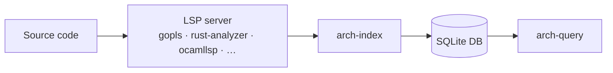
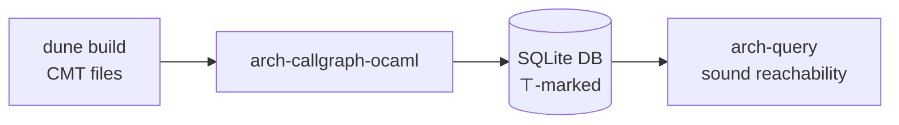

# arch-index

Builds a queryable **SQLite call-graph + symbol index** of any codebase a language server understands — OCaml, Go, Rust, TypeScript, Python. Turns manual code-reading into deterministic SQL queries, usable by both AI agents and human reviewers.

## Pipelines

**LSP path** — full symbol index via language server:



**CMT path** — sound ⊤-marked call graph via OCaml compiler artifacts (no live LSP):



**NDJSON path** — bring-your-own producer:


## Quick start

```sh
# Index a Go repo (point at the module root — the dir with go.mod)
./arch-index /path/to/repo /tmp/repo.db go
./arch-query /tmp/repo.db stats
./arch-query /tmp/repo.db reachable-from ServeHTTP
./arch-query /tmp/repo.db reaches ServeHTTP os.Exit   # exit/panic reachability
./arch-query /tmp/repo.db fan-in 20                   # top-20 shared sinks

# Index this repo's OCaml library (CMT path — no LSP needed)
opam exec -- dune build
./arch-callgraph-ocaml --build-dir=_build/default/lib/arch_index \
  --db-path=/tmp/self.db --schema-path=architecture-schema.sql
sqlite3 /tmp/self.db "SELECT count(*) FROM functions;"  # verify: should be ≥ 100
```

## Use cases for agents and reviewers

arch-index makes call-graph reachability answerable as a SQL query:

- **Reachability gates** — "does `paymentHandler` reach any `log_plaintext` sink?" → `reaches paymentHandler log_plaintext`. Block a PR if the path exists.
- **Attack-surface audit** — `exported` lists every externally-callable function. Cross-reference against an allowlist.
- **Variant analysis** — find all callers of a fixed function to check for unfixed siblings: `callers-of vulnerableHelper`.
- **Panic / exit reachability** — "is `os.Exit` reachable from `ServeHTTP`?" Useful for detecting accidental shutdown paths in request handlers.
- **Documentation quality** — every function row carries a `comment_quality_score` (0–100). Query `SELECT name FROM functions WHERE comment_quality_score < 50 AND exposed = 1` to surface underdocumented public API.
- **Metrics regression gate** — `arch-query <db> metrics` emits a flat JSON metrics object; `arch-compare baseline.json current.json` fails (exit 1) on any tracked-metric regression not covered by a reviewed `.metrics-accept` waiver (`<metric> <op> <bound>  # reason`). See [docs/adr/002-metrics-gate.md](docs/adr/002-metrics-gate.md).
- **Code-health queries** — `large-files [N]`, `large-functions [N]`, `god-modules [N]`, `missing-docs`, `missing-mli`, `unsafe-strings [N]` (string fields repeated ≥N times → newtype candidates), `duplicates` (same name+signature across modules), `type-search <field|-> [type]`. Plus `arch-body-compare --db DB --project-root DIR <name>` for body-hash duplicate verdicts (needs sources on disk). Main-schema oriented; commands refuse (exit 3) on indexes lacking their columns.
- **Curation layer** — `low-coverage [N]` (latest snapshot per function; populate via `arch-coverage-load --db DB < coverage.ndjson`), `gardening [open|log]` (task/worklog ledgers), `unsafe-params [unfixed|fixed|all]` (curated newtype-debt ledger). Ledgers are human-curated via documented SQL — see [docs/curation-workflow.md](docs/curation-workflow.md).

## MCP server (AI-agent access)

`arch-mcp` exposes the query surface as MCP tools over stdio — no bash required on the agent side:

```sh
opam exec -- dune build
claude mcp add arch-index -- "$PWD/arch-mcp" --db /abs/path/to/index.db
```

Tools: `arch_stats`, `arch_find`, `arch_exported`, `arch_fan_in`, `arch_callers_of`, `arch_callees_of`, `arch_reachable_from`, `arch_reaches`, `arch_unreachable`, `arch_escapes`, `arch_metrics`. The soundness contract is preserved: `arch_unreachable`/`arch_escapes` refuse (isError) on a non-⊤-marked index, exactly like the CLI's exit 3. Smoke test:

```sh
printf '%s\n' '{"jsonrpc":"2.0","id":1,"method":"initialize"}' | ./arch-mcp --db /tmp/self.db
```

## Documentation

- [Install & LSP backends](docs/install.md)
- [Edge-kind contract & soundness](docs/edge-kind-contract.md)
- [DB schema reference](docs/schema.md)
- [Formal soundness spec](SPEC-sound-callgraph.md)
