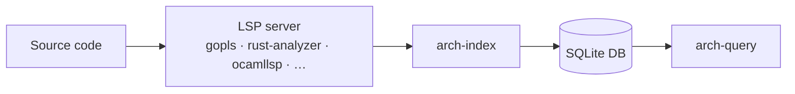
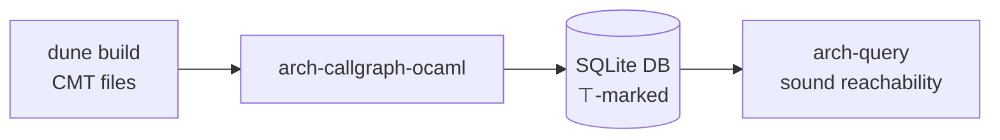
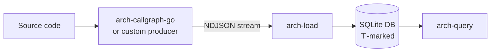

# arch-index

Builds a queryable **SQLite call-graph + symbol index** of any codebase a language server understands — OCaml, Go, Rust, TypeScript, Python. Turns manual code-reading into deterministic SQL queries, usable by both AI agents and human reviewers.

## Pipelines

**LSP path** — full symbol index via language server:



**CMT path** — sound ⊤-marked call graph via OCaml compiler artifacts (no live LSP):



**NDJSON path** — bring-your-own producer:



## Quick start

```sh
# Index a Go repo (point at the module root — the dir with go.mod)
./arch-index /path/to/repo /tmp/repo.db go
./arch-query /tmp/repo.db stats
./arch-query /tmp/repo.db reachable-from ServeHTTP
./arch-query /tmp/repo.db reaches ServeHTTP os.Exit   # exit/panic reachability
./arch-query /tmp/repo.db fan-in 20                   # top-20 shared sinks

# Index this repo's OCaml library (CMT path — no LSP needed)
opam exec -- dune build
./arch-callgraph-ocaml --build-dir=_build/default/lib/arch_index \
  --db-path=/tmp/self.db --schema-path=architecture-schema.sql
sqlite3 /tmp/self.db "SELECT count(*) FROM functions;"  # verify: should be ≥ 100
```

## Use cases for agents and reviewers

arch-index makes call-graph reachability answerable as a SQL query:

- **Reachability gates** — "does `paymentHandler` reach any `log_plaintext` sink?" → `reaches paymentHandler log_plaintext`. Block a PR if the path exists.
- **Attack-surface audit** — `exported` lists every externally-callable function. Cross-reference against an allowlist.
- **Variant analysis** — find all callers of a fixed function to check for unfixed siblings: `callers-of vulnerableHelper`.
- **Panic / exit reachability** — "is `os.Exit` reachable from `ServeHTTP`?" Useful for detecting accidental shutdown paths in request handlers.
- **Documentation quality** — every function row carries a `comment_quality_score` (0–100). Query `SELECT name FROM functions WHERE comment_quality_score < 50 AND exposed = 1` to surface underdocumented public API.

## Documentation

- [Install & LSP backends](docs/install.md)
- [Edge-kind contract & soundness](docs/edge-kind-contract.md)
- [DB schema reference](docs/schema.md)
- [Formal soundness spec](SPEC-sound-callgraph.md)
