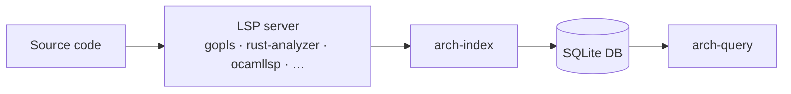
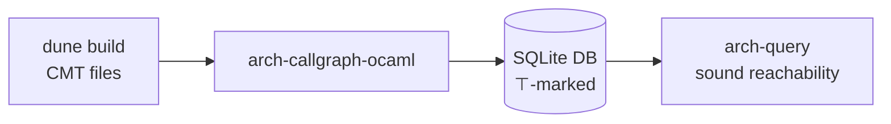
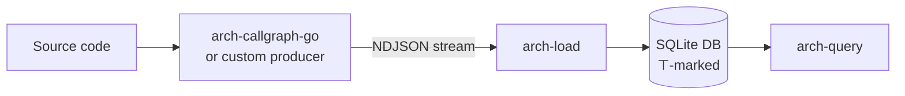

# arch-index

Builds a queryable **SQLite call-graph + symbol index** of any codebase a language server understands — OCaml, Go, Rust, TypeScript, Python. Turns manual code-reading into deterministic SQL queries, usable by both AI agents and human reviewers.

## Pipelines

**LSP path** — full symbol index via language server:


```mermaid
graph LR
  A[Source code] --> B["LSP server\ngopls · rust-analyzer · ocamllsp · …"]
  B --> C[arch-index]
  C --> D[(SQLite DB)]
  D --> E[arch-query]
```

**CMT path** — sound ⊤-marked call graph via OCaml compiler artifacts (no live LSP):


```mermaid
graph LR
  A["dune build\nCMT files"] --> B[arch-callgraph-ocaml]
  B --> D[("SQLite DB\n⊤-marked")]
  D --> E["arch-query\nsound reachability"]
```

**NDJSON path** — bring-your-own producer:


```mermaid
graph LR
  A[Source code] --> B["arch-callgraph-go\nor custom producer"]
  B -->|NDJSON stream| C[arch-load]
  C --> D[("SQLite DB\n⊤-marked")]
  D --> E[arch-query]
```

## Quick start

```sh
# Index a Go repo (point at the module root — the dir with go.mod)
./arch-index /path/to/repo /tmp/repo.db go
./arch-query /tmp/repo.db stats
./arch-query /tmp/repo.db reachable-from ServeHTTP
./arch-query /tmp/repo.db reaches ServeHTTP os.Exit   # exit/panic reachability
./arch-query /tmp/repo.db fan-in 20                   # top-20 shared sinks

# Index this repo's OCaml library (CMT path — no LSP needed)
opam exec -- dune build
./arch-callgraph-ocaml --build-dir=_build/default/lib/arch_index \
  --db-path=/tmp/self.db --schema-path=architecture-schema.sql
sqlite3 /tmp/self.db "SELECT count(*) FROM functions;"  # verify: should be ≥ 100
```

## Use cases for agents and reviewers

arch-index makes call-graph reachability answerable as a SQL query:

- **Reachability gates** — "does `paymentHandler` reach any `log_plaintext` sink?" → `reaches paymentHandler log_plaintext`. Block a PR if the path exists.
- **Attack-surface audit** — `exported` lists every externally-callable function. Cross-reference against an allowlist.
- **Variant analysis** — find all callers of a fixed function to check for unfixed siblings: `callers-of vulnerableHelper`.
- **Panic / exit reachability** — "is `os.Exit` reachable from `ServeHTTP`?" Useful for detecting accidental shutdown paths in request handlers.
- **Documentation quality** — every function row carries a `comment_quality_score` (0–100). Query `SELECT name FROM functions WHERE comment_quality_score < 50 AND exposed = 1` to surface underdocumented public API.
- **Change-impact briefing** — `./arch-impact /tmp/repo.db --diff main...HEAD` answers what a PR touches, which exported functions are affected, the blast radius, and where the ⊤ frontier makes that radius a lower bound rather than a bound. See [change impact](docs/change-impact.md).
- **Targeted mutation testing** — `./arch-mutants plan` decides what is worth mutating (test-reachable code only) and which tests must rerun for each target; `./arch-mutants report` attributes each surviving mutant to the tests that should have killed it. No engine of its own — it drives Mutaml, cargo-mutants, go-mutesting and friends. See [mutation testing](docs/mutation-testing.md).
- **Reachability-weighted coverage** — `./arch-coverage /tmp/repo.db coverage.lcov` answers which API-reachable functions are never exercised, which covered functions are only ⊤-reachable, and — crossed with `arch-mutants` — which are covered by tests that check nothing. LCOV in, so it works for every language. See [coverage](docs/coverage.md).
- **Agent access over MCP** — `arch_mcp` serves these verdicts to an agent, with a `provenance` block on every answer so it can tell "UNREACHABLE, proved over a ⊤-marked index" from "UNREACHABLE on an index that never marked ⊤". See [MCP server](docs/mcp-server.md).
- **Browsable index** — `./arch-serve /tmp/repo.db` serves the call graph as a local SPA on `http://localhost:7371` (loopback only), for the questions that are faster to answer by looking than by querying. Reads the flat schema produced by `arch-index` and `arch-load`; a main-schema index (from `arch-callgraph-ocaml`) is declined with a pointer to `arch-query`. See [arch-serve](docs/arch-serve.md).
- **Architecture fitness functions** — `./arch-rules /tmp/repo.db arch-rules.txt` enforces layering, export-surface and effect rules over the *sound* graph. Unlike ArchUnit/deptrac/import-linter, which check declared imports, it answers whether a call can actually reach — and says `UNKNOWN` instead of a green tick when it cannot tell. See [fitness functions](docs/fitness-functions.md).
- **How can this function fail?** — `arch-query /tmp/repo.db may-fail parse --channel result` answers with the *identities* it can fail with, transitively, minus what the handlers around each call site actually catch — a `throws` clause you never had to write. It covers exceptions **and** error-carrying values (`result`, `option`, Tezos `tzresult`, or your own monad declared in `arch-errors.toml`). The four answers it can give are kept strictly apart: a complete set (`BOUNDED`), a lower bound with witnesses for where it lost track (`UNBOUNDED (⊤)`), "this function cannot fail this way" (`NOT_A_CARRIER`), and "nobody looked" (`NOT_ANALYSED`, exit 3) — because an empty set and an unperformed analysis must never be confusable. See [error channels](docs/error-channels.md) and [exception raise-sets](docs/exception-raise-sets.md).

## Documentation

- [Install & LSP backends](docs/install.md)
- [Mutation testing, targeted by the call graph](docs/mutation-testing.md)
- [Reachability-weighted coverage](docs/coverage.md)
- [MCP server for agents](docs/mcp-server.md)
- [Browsing the index with arch-serve](docs/arch-serve.md)
- [Change impact for reviewers and agents](docs/change-impact.md)
- [Architecture fitness functions](docs/fitness-functions.md)
- [Error channels: how can this function fail?](docs/error-channels.md)
- [Exception raise-sets](docs/exception-raise-sets.md)
- [Porting the error analysis to another language](docs/error-channels-porting.md)
- [Edge-kind contract & soundness](docs/edge-kind-contract.md)
- [DB schema reference](docs/schema.md)
- [Curation workflow: measure → decide → ledger](docs/curation-workflow.md)
- [Formal soundness spec](SPEC-sound-callgraph.md)
