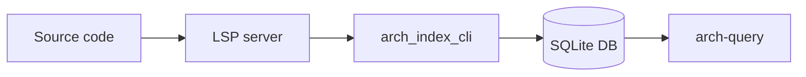
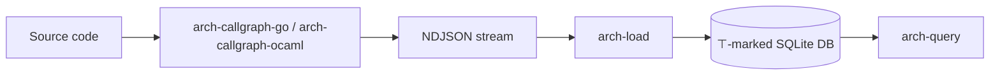

# Implementer Brief — docs-tests-ci

**Status:** VALIDATED
**Type:** chore
**Source plan:** briefs/docs-tests-ci-plan.md

## Goal

Clean up arch-index: short README with Mermaid diagrams, OCaml unit tests, shell selftests in CI, self-indexing golden test, linked docs/ files.

## Scope Boundary

OUT of scope:
- `selftest-callgraph-go.sh` / `selftest-callgraph-ocaml.sh` in CI (require live LSP)
- OCaml library refactors (no changes to `lib/arch_index/*.ml` logic)
- New arch-index features
- Binary build pipeline (`build.sh`)

## Files to Modify / Create

| File | Action | Notes |
|---|---|---|
| `dune-project` | Modify | Add `ppx_inline_test`, `ppx_assert`, `alcotest` to package deps |
| `arch-index.opam` | Modify | Add same deps (generated from dune-project, but may need manual sync) |
| `lib/arch_index/dune` | Modify | Add `(inline_tests)` stanza; add `ppx_inline_test ppx_assert` to pps list |
| `lib/arch_index/comment_parser.ml` | Modify | Add `let%test` inline tests at the bottom |
| `lib/arch_index/arch_index_comment_parser.ml` | Modify | Add `let%test` inline tests at the bottom |
| `lib/arch_index/arch_index_db.ml` | Modify | Add `let%test` inline tests (happy paths only — `:memory:` DB) |
| `test/dune` | Create | `(test (name test_contract) (libraries arch_index alcotest))` |
| `test/test_contract.ml` | Create | Alcotest suite: public `arch_index` API against in-memory DB |
| `.github/workflows/ci.yml` | Modify | Remove `|| true`, add Go setup, add shell test steps, add self-indexing step |
| `test/fixtures/self-index-stats.txt` | Create | Golden file for `arch-query stats` output — commit after first passing CI run |
| `docs/adr/001-self-index-golden.md` | Create | ADR explaining golden file policy |
| `docs/edge-kind-contract.md` | Create | Edge-kind / ⊤-marking / soundness content extracted from README |
| `docs/schema.md` | Create | DB schema reference linking to `architecture-schema.sql` |
| `docs/install.md` | Create | LSP backend install instructions per language |
| `README.md` | Modify | Rewrite: ≤ 50 lines of prose + Mermaid diagrams + links to docs/ |

## Sequential Steps

### 1. Add test framework deps
- Edit `dune-project`: add to `(depends ...)` inside the package stanza:
  ```
  (ppx_inline_test (>= 0.16))
  (ppx_assert (>= 0.16))
  (alcotest (>= 1.7))
  ```
- Edit `lib/arch_index/dune`: find the `(library ...)` stanza and add:
  - `(inline_tests)` as a sub-stanza
  - `ppx_inline_test ppx_assert` to the existing `(pps ...)` line (after `ppx_blob ppx_deriving_yojson`)
- Verify: `opam install --deps-only --yes .` picks up new deps; `dune build` still passes

### 2. Inline tests for `comment_parser.ml`
File: `lib/arch_index/comment_parser.ml`
Add `let%test` blocks at the bottom of the file (before any `end` if the file is a module body).
Test targets (read the .mli first to find the public API):
- Tag extraction: `@pre`, `@post`, `@violators` parsed correctly from multi-line doc strings
- `make_body` with `"none"`, `"(none)"`, empty string, and a real value
- Score field: verify numeric value parses out of a doc comment
- Edge case: empty comment, comment with only whitespace

### 3. Inline tests for `arch_index_comment_parser.ml`
File: `lib/arch_index/arch_index_comment_parser.ml`
This is the OCaml `{tag}` style parser (different syntax from the JSDoc parser in `comment_parser.ml`).
Add `let%test` blocks covering:
- `{pre}`, `{post}`, `{violators}` tag extraction
- Multi-tag comment parsing
- Edge case: empty `{tag}` content

### 4. Inline tests for `arch_index_db.ml` (happy paths only)
File: `lib/arch_index/arch_index_db.ml`
- This module is in `(private_modules ...)` — must use inline tests, cannot be reached from `test/`
- `exec_exn` calls `exit 1` on SQL errors — DO NOT test error paths; the test runner would die
- Use `:memory:` for the SQLite DB in every test: `let db = Sqlite3.db_open ":memory:"`
- Test targets:
  - Schema creation: call the schema init function, verify tables exist via `sqlite3 "SELECT name FROM sqlite_master WHERE type='table'"` query
  - Function insert + read back
  - Call insert + read back
  - `comment_db_meta` key/value write + read

### 5. Alcotest integration suite
Create `test/dune`:
```scheme
(test
 (name test_contract)
 (libraries arch_index alcotest))
```
Create `test/test_contract.ml`:
- Test the public `arch_index` module API (not private modules — only what `lib/arch_index/arch_index.mli` exports)
- Use Alcotest.test_case with named cases and `Alcotest.check` assertions
- Cover: create an index from a minimal NDJSON-equivalent (via the OCaml API if available), run a stats query, verify expected fields
- If `arch_index.mli` only exports the CLI entry point, test at least the DB schema round-trip via whatever is exported

### 6. Fix CI: remove `|| true`, add shell tests
Edit `.github/workflows/ci.yml`:
- Change `run: opam exec -- dune test || true` → `run: opam exec -- dune test`
- Add after the `Test` step:
  ```yaml
  - name: Shell integration tests
    run: |
      chmod +x selftest-contract.sh selftest-load.sh
      ./selftest-contract.sh
      ./selftest-load.sh
  ```

### 7. Self-indexing CI step + golden file + ADR
Edit `.github/workflows/ci.yml`, add before the release job:
```yaml
- name: Setup Go
  uses: actions/setup-go@v5
  with:
    go-version-file: 'callgraph-go/go.mod'

- name: Build arch-callgraph-ocaml
  run: |
    cd callgraph-go && go build -o ../arch-callgraph-ocaml-bin .
    # Make the wrapper use our freshly built binary (check wrapper script for the expected binary name)

- name: Self-index smoke test
  run: |
    opam exec -- dune build  # ensure CMT files exist (already built above, but be explicit)
    ./arch-callgraph-ocaml _build/default/lib/arch_index/ /tmp/self.db
    ./arch-query /tmp/self.db stats > /tmp/self-stats.txt
    diff test/fixtures/self-index-stats.txt /tmp/self-stats.txt
```

**Golden file bootstrap** (do this locally before pushing):
1. `opam exec -- dune build`
2. Build `arch-callgraph-ocaml` locally
3. `./arch-callgraph-ocaml _build/default/lib/arch_index/ /tmp/self.db`
4. `./arch-query /tmp/self.db stats > test/fixtures/self-index-stats.txt`
5. Commit `test/fixtures/self-index-stats.txt`

Create `docs/adr/001-self-index-golden.md`:
```markdown
# ADR 001 — Self-index golden file

**Status:** Active  
**Date:** 2026-06-25

## Decision
arch-query stats output for self-indexing is stored in `test/fixtures/self-index-stats.txt`
and diffed in CI. Any change to the output fails CI until the golden file is updated.

## Update procedure
1. Run locally: `./arch-callgraph-ocaml _build/default/lib/arch_index/ /tmp/self.db`
2. `./arch-query /tmp/self.db stats > test/fixtures/self-index-stats.txt`
3. Verify the new output is expected (e.g. function count went up after adding a module)
4. Commit the updated golden file with a message explaining why the count changed

## Rationale
Arbitrary thresholds (≥10 functions) provide no regression signal. A golden diff catches
any unexpected change — added, removed, or reordered output — without manual bookkeeping.
```

### 8. Create `docs/` files
Create `docs/edge-kind-contract.md`:
- Extract from README: the edge-kind table (MUST/MAY_ENUMERATED/MAY_TOP), semantics, soundness rationale
- Extract from `SPEC-sound-callgraph.md`: the soundness proof sketch and under/over-approximation explanation
- Keep `SPEC-sound-callgraph.md` as-is — link to it from `docs/edge-kind-contract.md` for the formal treatment

Create `docs/schema.md`:
- Brief description of `functions` and `calls` tables (5–10 lines)
- Link to `architecture-schema.sql` for the full schema
- Note the `comment_db_meta` table and `callgraph_contract` key

Create `docs/install.md`:
- Extract from README: LSP backend install instructions per language (Go/Rust/TS/Python/OCaml)
- Include: binary build instructions (`build.sh`), note on gitignored binary

### 9. Rewrite README
Target: ≤ 50 lines of prose + Mermaid diagrams.

Structure:
```
# arch-index

<1 paragraph: what it is, what it produces>

## Pipelines





## Quick start

\```sh
./arch-index /path/to/repo /tmp/repo.db go
./arch-query /tmp/repo.db stats
./arch-query /tmp/repo.db reachable-from FinalizeBlock
\```

## Documentation

- [Install LSP backends](docs/install.md)
- [Edge-kind contract & soundness](docs/edge-kind-contract.md)
- [DB schema reference](docs/schema.md)
- [Formal soundness spec](SPEC-sound-callgraph.md)
```

## Quality Gates

```bash
# Build
opam exec -- dune build

# OCaml unit + integration tests
opam exec -- dune test

# Shell selftests (self-contained)
./selftest-contract.sh
./selftest-load.sh

# Self-indexing (requires arch-callgraph-ocaml binary built from callgraph-go/)
./arch-callgraph-ocaml _build/default/lib/arch_index/ /tmp/self.db
./arch-query /tmp/self.db stats
diff test/fixtures/self-index-stats.txt <(./arch-query /tmp/self.db stats)
```

## Points of Attention from Risk Analysis

- **ppx pps order**: `(pps ppx_blob ppx_deriving_yojson ppx_inline_test ppx_assert)` — if dune complains about ppx driver conflicts, try a separate `(preprocess (pps ...))` stanza for tests only using `(inline_tests (deps ...))` approach
- **`arch_index_db.exec_exn` calls `exit 1`**: only write happy-path inline tests; document the limitation in a comment above the tests
- **`_build/` CMT path**: verify `arch-callgraph-ocaml _build/default/lib/arch_index/` produces output before committing the golden file — if the path is wrong, `arch-load` will get 0 functions and abort (zero-edge guard)
- **Go binary name**: check `arch-callgraph-ocaml` shell wrapper to see what binary name it expects; match it in the CI build step
- **Golden file bootstrap**: must be done locally before the CI self-index step can pass — CI cannot create its own golden file
